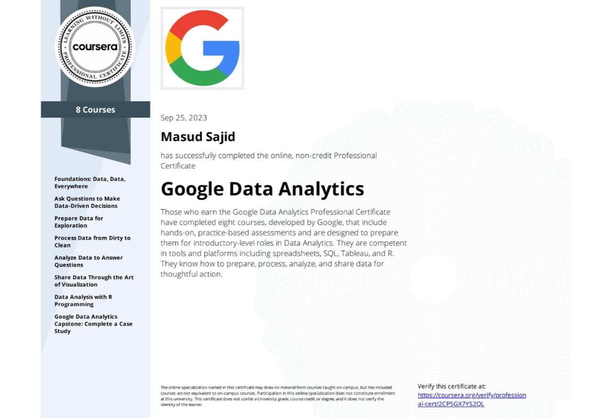

# Google Data analytics Professional Certificate

Consisting of 8 core courses, this certificate had 100+ video lectures, 30+ assessment tests and much more. I was able to develop skills in tools like Microsoft Excel, Google sheets, Tableau, Power BI RStudio and SQL server. Some were part of the courses and others were developed out of passion.

This certificate allowed me to enter the fascinating word of data analytics with a strong base. I look forward to exploring more advanced topics and techniques and applying them to real-world problems.

# Scientific Computing with Python

I had learnt OOP and DSA (in C++) as university courses, but it is always better to learn a more in-demand programming language. This course taught basic syntax of the language, OOP and data structures concepts, python in databases, networking protocols and much more. 

5 projects had to be submitted for collection of the certificate. These projects tested all the knowledge shared throughout the course. I have to say this is the easiest language to understand and work in (way easier than C++ for sure).

